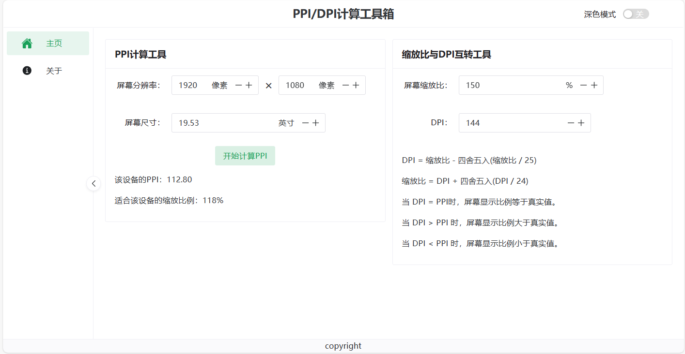
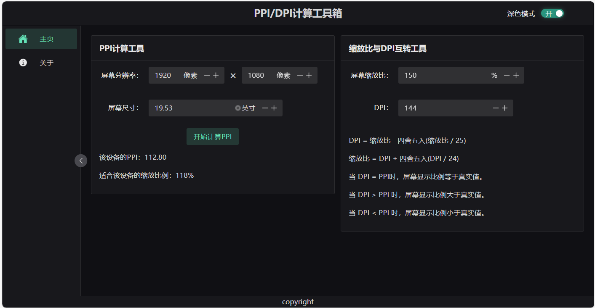
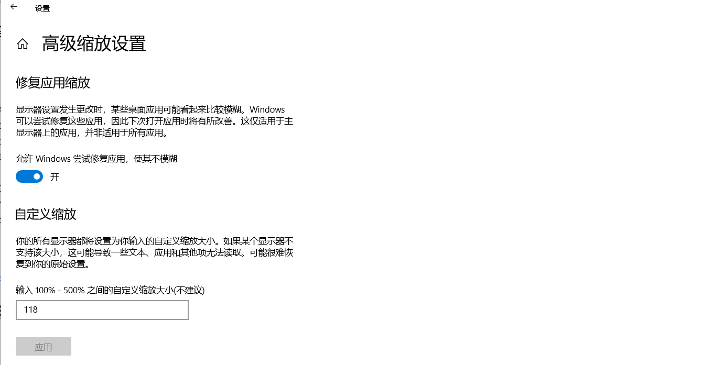

# PPI计算工具、屏幕缩放倍数与DPI互转工具

帮助你找到最适合你显示器的屏幕缩放倍数，仅限Windows

觉得缩放倍数过高或者过低？来算算哪个值适合自己的显示器吧。

[在线演示地址](https://guohaomeng.github.io/ppi_dpi_calculate/)

## DPI与缩放比换算公式

DPI = 缩放比 - 四舍五入(缩放比 / 25)

缩放比 = DPI + 四舍五入(DPI / 24)

当 DPI = PPI时，屏幕显示比例等于真实值。

当 DPI > PPI 时，屏幕显示比例大于真实值。

当 DPI < PPI 时，屏幕显示比例小于真实值。
